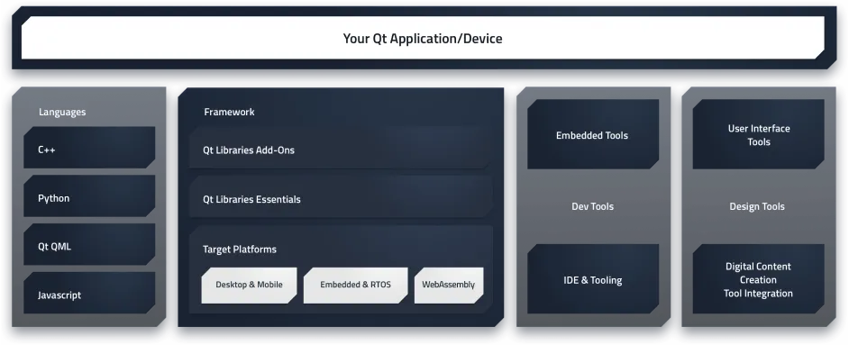
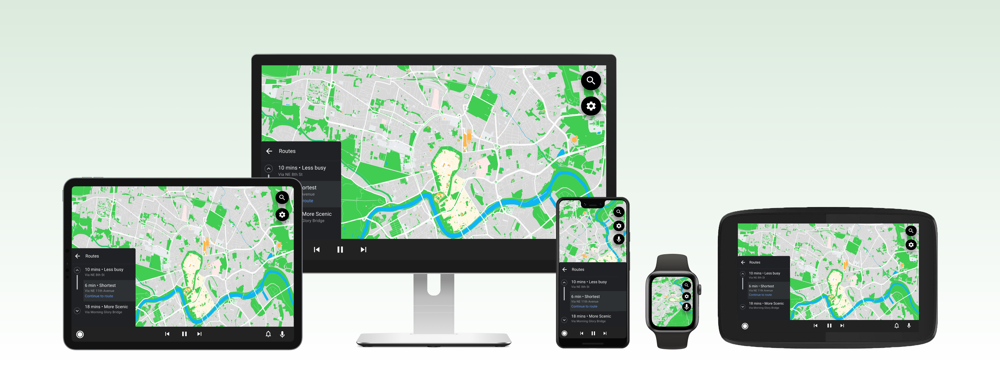
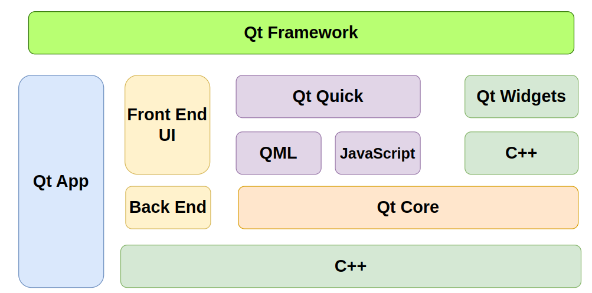

## 1. QT

**Qt** is a powerful, cross-platform development framework primarily used for creating graphical user interfaces (GUIs), although it also supports non-GUI functionalities like networking, file handling, and multimedia. It is written in C++ and provides a rich set of libraries, tools, and features for building modern applications.

 **Features:**

- **Cross-Platform**: Write once, deploy anywhere (Windows, macOS, Linux, Android, iOS, and embedded platforms).

  

- **Performance**: Written in C++, ensuring high performance and low resource usage.

- **Extensibility**: Provides a rich set of libraries and modules for diverse application needs.

------

#### 1.1. Qt Tools

Qt tools are a collection of utilities and development tools provided by the Qt framework to assist developers in creating, debugging, testing, and optimizing applications. These tools enhance productivity and streamline the development process, especially for cross-platform applications.

**1.1.1. Qt Creator**

The official Integrated Development Environment (IDE) for Qt development and its Features:

- Code editing with syntax highlighting and autocompletion.
- Graphical user interface (GUI) designer for creating layouts.
- Built-in debugger for both C++ and QML.
- Cross-platform support for building, running, and debugging.
- Integration with version control systems like Git.
- Profiling tools for performance optimization.

**1.1.2. Qt Design Studio**

- **What it is**: A tool for UI/UX designers to create fluid, animated UIs using **Qt Quick/QML**.
- Its Features:
  - Visual design and prototyping of QML interfaces.
  - Import designs from tools like Adobe XD or Photoshop.
  - WYSIWYG (What You See Is What You Get) editor for creating QML components.
  - Export QML code directly into the Qt project.

**1.1.3. Qt Linguist**

- **What it is**: A translation and internationalization tool.
- **Purpose:**
  - Translate text in Qt applications to multiple languages.
  - Manage `.ts` translation files.
-  **Features:**
  - Provides a user-friendly UI for translators.
  - Supports context-based translations.
  - Integrates with the `lupdate` and `lrelease` command-line tools.

------------------

**1.1.4. Qt Assistant**

- **What it is**: A help viewer and documentation browser.
- **Purpose:**
  - Display Qt’s extensive documentation in a structured format.
- **Features**:
  - Search and navigate the Qt API and libraries.
  - Browse documentation offline.

----------------------------------------------------

**1.1.5. Qt Installer Framework**

- **What it is**: A tool for creating installers for your Qt applications.
-  **Features:**
  - Build cross-platform installers.
  - Create both online and offline installation packages.
  - Supports customization of installation wizards.

--------------------

**1.1.6. Qt Designer**

- **What it is**: A standalone GUI layout and form designer tool.
- **Purpose**:
  - Design UI layouts with drag-and-drop functionality.
- **Features:**
  - Generate `.ui` files that can be directly integrated into Qt projects.
  - Use with Qt Widgets-based projects.

-----------------------

**1.1.7. Qt Debugging Tools**

- **GammaRay**: An introspection tool for debugging and visualizing your Qt application’s internals.
- **QML Profiler**: Analyze the performance of QML code and locate bottlenecks in animations or rendering.
- **Valgrind Support**: Memory leak detection and performance profiling.

----------------

**1.1.8. Qt Test**

- **What it is**: A module for writing and running unit tests.
- **Features:**
  - Create automated tests for both GUI and backend functionality.
  - Generate detailed test reports.

--------------------------

**1.1.9. Qt Creator Analyzer Tools**

- **Clang Static Analyzer**: Integrated into Qt Creator to detect potential issues in your code.
- **Sanitizers**: Integration with AddressSanitizer, ThreadSanitizer, and UndefinedBehaviorSanitizer for debugging.

-------------------------------------------

**1.1.10. Qt Quick Compiler**

- **What it is**: A tool to compile QML code into binary form.
- **Features:**
  - Speeds up application loading times.
  - Protects QML source code from being exposed in production.

-------------------

**1.1.11. Qt Resource Compiler (`rcc`)**

- **What it is**: A command-line tool to embed resources (e.g., images, fonts, and other files) into your application binary.
- Use: to Manage resources via `.qrc` files.

-----------------

**1.1.12. Qt Maintenance Tool**

- **What it is**: A tool for managing your Qt installation.
- **Purpose:**
  - Update, modify, or uninstall Qt components and versions.
- **Features:**
  - Add or remove specific Qt modules.
  - Update to the latest Qt releases.

------------------------

**1.1.13. Other Command-Line Tools**

- **`qmake`**: Qt’s build system to manage project configurations and compile code.
- **`uic` (User Interface Compiler)**: Converts `.ui` files from Qt Designer into C++ code.
- **`moc` (Meta-Object Compiler)**: Processes Qt’s signals and slots in C++.

---------------------------------

### 2. **Qt Framework**

The **Qt Framework** is a comprehensive  **cross-platform development toolkit** that enables developers to create applications and user interfaces for multiple platforms (such as Windows, macOS, Linux, iOS, Android, and embedded systems) using a unified codebase.

>A **framework** is a collection of pre-written code that provides a structure and reusable components for software development. 

It provides a rich set of **libraries**, **tools**, and **APIs** that simplify the development of **graphical user interfaces (GUIs)**, as well as non-GUI functionalities such as networking, database handling, file I/O, threading, and more.

#### 2.1. **Core Libraries**

- **Qt Core**: Base functionality like threading, data containers, file handling, and time management.
- **Qt GUI**: Tools for building rich graphical user interfaces.
- **Qt Widgets**: A library of traditional desktop UI components such as buttons, sliders, and menus.

#### 2.2. Qt User Interface Creation Kit (QtQuick)

**Qt Quick** is a high-level module in the Qt framework, specifically designed for creating modern, touch-friendly, and visually rich user interfaces. It provides a declarative language, **QML (Qt Modeling Language)**, to define the structure, behavior, and appearance of the UI. Qt Quick is ideal for developing dynamic and interactive applications for mobile, desktop, embedded systems, and IoT devices.

**Use Cases for Qt Quick**

1. **Touch-Friendly Applications:**
   - Ideal for mobile devices, kiosks, and touchscreens.
2. **Graphical Interfaces:**
   - Applications requiring fluid animations, transitions, or 3D graphics.
3. **Embedded Systems:**
   - User interfaces for IoT devices, medical equipment, or automotive dashboards.
4. **Dynamic Data Visualizations:**
   - Dashboards, charts, and real-time updates for data-driven applications.

#### 2.3. **Specialized Modules**

- **Qt Multimedia**: For audio and video playback, recording, and processing.
- **Qt Network**: Networking tools for HTTP, TCP/IP, and more.
- **Qt Charts, Qt 3D, Qt Data Visualization**: For advanced visualizations and data representation.
- **Qt for Python (PySide6)**: Allows developers to use Qt with Python.

#### 2.4. **Development Tools**

- **Qt Creator**: The official Integrated Development Environment (IDE) for Qt development.
- **Qt Design Studio**: A tool for designers to create UI/UX for Qt Quick applications.

----------------------

### 3. Qt Core

**Qt Core** is a fundamental module of the Qt framework that provides the basic building blocks for all Qt-based applications. It offers essential non-GUI functionality such as event handling, object communication, and data structures. Since it’s the backbone of the Qt framework, almost every other module in Qt depends on Qt Core.

------

### 3.1. **Features of Qt Core**

1. **Object Management**:
   - Provides the `QObject` base class for all Qt objects, supporting features like:
     - **Signals and Slots**: A mechanism for object communication.
     - **Event Handling**: Processing and propagating events within the application.
2. **Data Structures**:
   - Includes efficient and versatile container classes like:
     - `QList`, `QVector`, `QMap`, `QHash`, etc.
3. **File and Resource Management**:
   - File I/O with classes like `QFile` and `QDir`.
   - Resource management through `.qrc` files.
4. **Timers and Threads**:
   - Manage tasks using `QTimer` for periodic execution.
   - Multi-threading support with classes like `QThread` and `QMutex`.
5. **Text and String Handling**:
   - Unicode-based string manipulation with `QString`.
   - Regular expression handling via `QRegularExpression`.
6. **Localization and Internationalization**:
   - Support for translations and locale-specific functionality (`QLocale`).
7. **Time and Date**:
   - Classes like `QDate`, `QTime`, and `QDateTime` for working with temporal data.
8. **Plugin Framework**:
   - Loadable plugins with `QPluginLoader`.

### 4. Qt Modeling Language (QML)

Qt QML is a declarative language for designing modern UIs. It emphasizes:

- **Declarative Syntax**: Describes what the UI should look like and how it behaves.
- **Dynamic and Reactive Programming**: Simplifies handling user interactions and animations.
- **JavaScript Integration**: For logic and dynamic behavior.
- **Qt Quick**: The accompanying runtime framework for creating animated and fluid user interfaces.

### 5. Difference Between Qt Quick (QML) and Qt Widgets

**5.1. Overview**

| **Aspect**     | **Qt Widgets**                                | **Qt Quick**                                     |
| -------------- | --------------------------------------------- | ------------------------------------------------ |
| **Purpose**    | Traditional, desktop-style UIs.               | Modern, touch-friendly, fluid UIs.               |
| **Technology** | C++ with a procedural approach.               | QML (declarative language) + JavaScript.         |
| **Focus**      | Application functionality and business logic. | Visual richness, animations, and responsiveness. |

**5.2. UI Design**

| **Aspect**         | **Qt Widgets**                             | **Qt Quick**                                     |
| ------------------ | ------------------------------------------ | ------------------------------------------------ |
| **Look and Feel**  | Native desktop app style (buttons, menus). | Customizable, animated, modern designs.          |
| **Customization**  | Limited compared to Qt Quick.              | Highly customizable with animations and effects. |
| **Responsiveness** | Less suited for touchscreens.              | Excellent for touchscreens and fluid interfaces. |

**5.3. Performance**

| **Aspect**         | **Qt Widgets**                         | **Qt Quick**                                    |
| ------------------ | -------------------------------------- | ----------------------------------------------- |
| **Rendering**      | CPU-based rendering.                   | GPU-accelerated rendering (via OpenGL, Vulkan). |
| **Performance**    | Suitable for lightweight desktop apps. | Better for graphics-heavy applications.         |
| **Resource Usage** | Lower memory consumption.              | Can use more memory due to GPU rendering.       |

**5.4. Development Model**

| **Aspect**               | **Qt Widgets**                           | **Qt Quick**                                          |
| ------------------------ | ---------------------------------------- | ----------------------------------------------------- |
| **Programming Language** | C++ only.                                | QML + JavaScript + optional C++ backend.              |
| **Ease of Learning**     | Easier for developers familiar with C++. | Easier for designers or those with web/UI background. |
| **Prototyping**          | Slower; UI and logic are intertwined.    | Faster; visual and logic layers are separated.        |

**4.5. Use Cases**

| **Aspect**            | **Qt Widgets**                                               | **Qt Quick**                                                 |
| --------------------- | ------------------------------------------------------------ | ------------------------------------------------------------ |
| **Ideal For**         | Desktop applications with traditional UIs, e.g., IDEs, spreadsheets, file managers. | Modern, interactive, and touch-friendly apps, e.g., mobile apps, IoT dashboards. |
| **Cross-Platform UI** | Limited; styles depend on the OS.                            | Highly portable with consistent UI across platforms.         |

**5.6. Ecosystem**

| **Aspect**   | **Qt Widgets**                               | **Qt Quick**                                     |
| ------------ | -------------------------------------------- | ------------------------------------------------ |
| **Maturity** | Older, more stable, with rich documentation. | Newer but rapidly maturing.                      |
| **Tooling**  | Qt Designer for visual design.               | Qt Design Studio for QML design and prototyping. |

**5.7. Advantages and Limitations**

#### **Qt Widgets**:

- Advantages:
  - Rich set of native desktop UI components.
  - Lightweight, efficient for traditional applications.
  - Easier for developers experienced in C++.
- Limitations:
  - Less customizable and not ideal for modern, fluid UIs.
  - Lacks GPU acceleration.

#### **Qt Quick**:

- Advantages:
  - Great for animations, custom UIs, and touch interfaces.
  - Faster prototyping due to declarative QML syntax.
  - GPU-accelerated rendering for complex visuals.
- Limitations:
  - Higher memory usage for graphics-heavy apps.
  - Requires familiarity with QML and JavaScript.

------

### **How to Choose?**

1. **Use Qt Widgets if**:
   - Your project is a traditional desktop application.
   - You need native look-and-feel without extensive customizations.
   - You prioritize low resource usage.
2. **Use Qt Quick if**:
   - Your project demands modern, fluid, and touch-friendly UIs.
   - smoother Animation, responsiveness, and a custom look are critical.
   - You’re targeting embedded systems, mobile, or IoT.

---------------

#### 6. Qt Building Blocks
Qt 6 consists of a large number of modules. In general, a **module is a library for the developer to use**. Some modules are mandatory for a Qt-enabled platform and form the set called **Qt Essentials Modules.** Other modules are optional, and form the **Qt Add-On Modules.** The majority of developers may not need to use the latter, but it’s good to know about them as they provide invaluable solutions to common challenges.

#### 6.1. Qt Modules
The Qt Essentials modules are mandatory for any Qt-enabled platform. They offer the foundation to develop modern Qt 6 Applications using Qt Quick 2. The full list of modules is available in the Qt documentation module list  [HERE](https://doc.qt.io/qt-6/qtmodules.html#qt-essentials).

#### 6.2. Core-Essential Modules
It is the minimal set of Qt 6 modules to start QML programming.

- **Qt Core** - Core non-graphical classes used by other modules.
- **Qt D-BUS**- Classes for inter-process communication over the D-Bus protocol on linux.
- **Qt GUI** - Base classes for graphical user interface (GUI) components. Includes OpenGL.
- **Qt Network** - Classes to make network programming easier and more portable.
- **Qt QML** - Classes for QML and JavaScript languages.
- **Qt Quick** - A declarative framework for building highly dynamic applications with custom user interfaces.
- **Qt Quick Controls** - Provides lightweight QML types for creating performant user interfaces for desktop, embedded, and mobile devices. These types employ a simple styling architecture and are very efficient.
- **Qt Quick Layouts** - Layouts are items that are used to arrange Qt Quick 2 based items in the user interface.
- **Qt Quick Test** - A unit test framework for QML applications, where the test cases are written as JavaScript functions.
- **Qt Test** - Classes for unit testing Qt applications and libraries.
- **Qt Widgets** - Classes to extend Qt GUI with C++ widgets.
- **Qt Add-On Modules** :
  Besides the essential modules, Qt offers additional modules that target specific purposes. Many add-on modules are either feature-complete and exist for backwards compatibility, or are only applicable to certain platforms. Here is a list of some of the available add-on modules, but make sure you familiarize yourself with them all in the Qt documentation add-ons list (opens new window)and in the list below.

- **Network:** Qt Bluetooth / Qt Network Authorization

- **UI Components**: Qt Quick 3D / Qt Quick Timeline / Qt Charts / Qt Data Visualization / Qt Lottie Animation / Qt Virtual Keyboard

- **Graphics**: Qt 3D / Qt Image Formats / Qt OpenGL / Qt Shader Tools / Qt SVG / Qt Wayland Compositor

- **Helper**: Qt 5 Core Compatibility APIs / Qt Concurrent / Qt Help / Qt Print Support / Qt Quick Widgets / Qt SCXML / Qt SQL / Qt State Machine / Qt UI Tools / Qt XML

  > **TIP** :
  > As these modules are not part of the release, the state of each module may differ depending on how many contributors are active and how well it’s tested.

