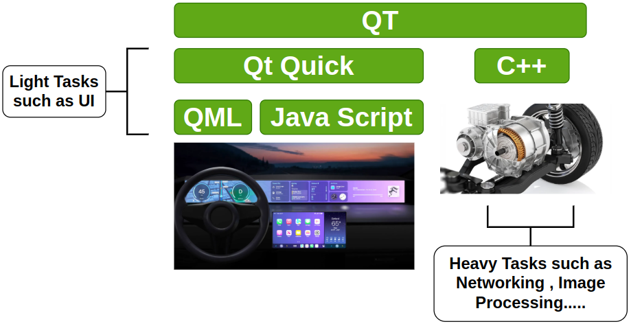
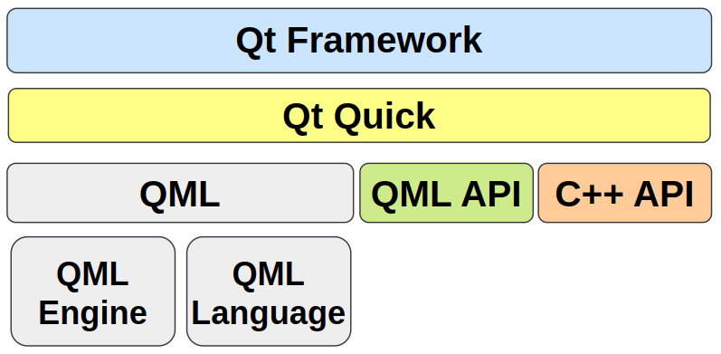

# Qt6 QML
### 1. QML (Qt Modeling Language)

**QML** is a declarative language designed for building **fluid, dynamic, and modern user interfaces (UIs)**, part of the **Qt Quick** module in the Qt framework. It allows developers to describe what the UI should look like and how it should behave using a clean, JSON-like syntax.

------

### 1.1. Features of QML

1. **Declarative Syntax**:

   - QML's syntax is simple and intuitive, making it easy to design interfaces. It focuses on "what to display" rather than "how to display."

   - Example:

     ```c++
     Rectangle {
         width: 200
         height: 100
         color: "blue"
         Text {
             anchors.centerIn: parent
             text: "Hello, QML!"
         }
     }
     ```

2. **Dynamic Behavior**:

   - QML allows you to define animations, transitions, and behaviors directly in the markup.

   - Example:

     ```c++
     Rectangle {
         width: 100; height: 100
         color: "red"
         Behavior on color {
             ColorAnimation { duration: 1000 }
         }
         MouseArea {
             anchors.fill: parent
             onClicked: color = "green"
         }
     }
     ```

3. **Integration with JavaScript**:

   - QML supports JavaScript for logic, enabling powerful scripting capabilities within the QML environment.

   - Example:

     ```js
     Rectangle {
         id: rect
         width: 100; height: 100; color: "blue"
         MouseArea {
             anchors.fill: parent
             onClicked: {
                 rect.color = rect.color === "blue" ? "red" : "blue";
             }
         }
     }
     ```

4. **Modular Components**:

   - QML allows creating reusable components, making it easy to manage complex UIs.

   - Example of a reusable component:

     `MyButton.qml`:

     ```c++
     Rectangle {
         property string label
         width: 100; height: 50; color: "gray"
         Text {
             anchors.centerIn: parent
             text: label
         }
         MouseArea {
             anchors.fill: parent
             onClicked: console.log("Button clicked!")
         }
     }
     ```

------

### 1.2. **How QML Works**

- **Qt Quick Elements**: QML comes with predefined elements such as `Rectangle`, `Text`, `Image`, `MouseArea`, and more. These elements can be used to construct UIs easily.
- **C++ Integration**: Developers can expose C++ objects and logic to QML, allowing seamless communication between the backend and the UI.

------

### 1.3. **QML in Qt 6**

With **Qt 6**, QML has seen several enhancements and improvements that make it more powerful and efficient for modern UI development.

**1.3.1. Enhanced Performance**

- Qt 6 uses **Qt RHI (Rendering Hardware Interface)** to support **Vulkan**, **Metal**, and **Direct3D**, improving rendering performance on modern hardware.
- GPU-accelerated rendering ensures smooth animations and transitions.

**1.3.2. Stronger Type Checking**

- QML in Qt 6 introduces improved type checking, making development safer and reducing runtime errors.

- Example:

  ```c++
  Rectangle {
      width: "200px"  // This will trigger a warning for an incorrect type
  }
  ```

**1.3.3. Improved Integration with C++**

- Qt 6 enhances the `Qt Quick` module, making it easier to bind C++ data models and business logic to QML.

- Example of exposing a model:

  ```c++
  class MyModel : public QAbstractListModel {
      // Implementation of the model
  };
  ```

  In QML:

  ```c++
  ListView {
      model: myCppModel
      delegate: Text { text: modelData }
  }
  ```

**1.3.4. Qt Quick 3D**

- Qt 6 expands QML’s capabilities to include **3D rendering**. With **Qt Quick 3D**, developers can create 3D scenes alongside 2D UIs.

- Example:

  ```c++
  View3D {
      anchors.fill: parent
      importScene: "scene.gltf"
      camera: PerspectiveCamera {
          position: Qt.vector3d(0, 0, 10)
      }
  }
  ```

**1.3.5. Asynchronous Loading**

- Qt 6 provides better support for asynchronous operations, such as loading images, fetching data, or initializing complex components.

**1.3.6. QML Compiler**

- Qt 6 includes an improved QML compiler that converts QML into highly optimized C++ code, resulting in faster application performance.

------

### 1.4. **Advantages of Using QML**

- **Rapid UI Development**: Simplifies the process of creating modern, dynamic UIs.
- **Cross-Platform**: Works seamlessly across desktop, mobile, and embedded platforms.
- **Flexibility**: Combines the simplicity of declarative design with the power of JavaScript and C++.
- **Modern Graphics**: Built for GPU acceleration and advanced rendering.

------

### 1.5. **When to Use QML in Qt 6**

- **Applications with Rich UIs**: Ideal for building dynamic, fluid, and visually rich interfaces (e.g., mobile apps, dashboards, infotainment systems).
- **Cross-Platform Development**: When you need a consistent UI across multiple platforms with minimal effort.
- **IoT and Embedded Systems**: Perfect for devices with touch interfaces and constrained hardware, thanks to its efficiency and scalability.

------

### **QML vs. Qt Widgets**

| **Aspect**         | **QML (Qt Quick)**             | **Qt Widgets**                |
| ------------------ | ------------------------------ | ----------------------------- |
| **Use Case**       | Modern, fluid UIs              | Traditional desktop-style UIs |
| **Performance**    | GPU-accelerated rendering      | CPU-based rendering           |
| **Language**       | Declarative (QML + JavaScript) | Imperative (C++)              |
| **3D Support**     | Strong (Qt Quick 3D)           | Limited                       |
| **Learning Curve** | Easier for UI design           | Steeper, more verbose code    |

------------------------

### 2. Qt Quick(QML/Js) and C++

In the **Qt** Framework , when to use QML and when to use C++ ?




**3.1. Use QML/Js for Light UI Tasks:**

QML, along with **JavaScript**, is ideal for handling **frontend and UI-related tasks** due to its declarative nature and dynamic capabilities. It excels at:

1. **User Interface Design:**
   - Creating modern, fluid, and visually appealing interfaces.
   - Managing layouts, animations, and transitions.
2. **Event Handling:**
   - Handling simple user interactions (e.g., button clicks, gestures).
   - Responding to signals and slots within the UI.
3. **Rapid Prototyping:**
   - Quickly iterating and testing UI designs without the need to recompile.
4. **Frontend Logic:**
   - Implementing lightweight logic using embedded JavaScript (e.g., form validation or simple calculations).

--------------

**3.2. Use C++ for Heavy Backend Tasks:**

C++ is the backbone for **performance-critical tasks** and integrates seamlessly with QML to handle:

1. **Complex Logic and Algorithms:**
   - Heavy computations, such as simulations, data analysis, or AI tasks.
   - Sophisticated business logic that requires performance optimization.
2. **Hardware Integration:**
   - Accessing low-level hardware resources like sensors, cameras, or motors (as shown in the automotive example in the diagram).
3. **Networking:**
   - Managing real-time communications, web sockets, or API integrations.
   - Implementing protocols like TCP/IP, MQTT, or HTTP.
4. **Image Processing & Multimedia:**
   - Processing high-resolution images or videos.
   - Custom video rendering and real-time effects.
5. **Extending QML:**
   - Writing custom QML components in C++ and exposing them to the QML layer.

-------------------------

**When to Combine QML and C++**

- Use **QML** for **UI presentation and interaction**.
- Use **C++** for **backend functionality and performance-intensive tasks**.
- Bridge QML and C++ using **Qt's Signal-Slot Mechanism** or expose C++ objects to QML via **QQmlContext**.

----------------

**Practical Example (Automotive UI Example in Diagram):**

1. **QML Usage:**
   - UI dashboards with animations for speedometers, fuel gauges, and media controls.
   - Interactivity with touchscreen buttons.
2. **C++ Usage:**
   - Handling CAN bus communication for real-time data from the car’s sensors.
   - Processing image feeds from cameras or handling autonomous driving algorithms.

By combining both, you can create high-performance applications with a polished user experience.

------------------------------------

### 3. QML Architecture



#### 3.1. **Qt Quick**

Qt Quick is the umbrella framework that enables developers to build dynamic, fluid, and modern user interfaces. It includes:

- **QML Language**: A declarative programming language used to design UI components.
- **QML Engine**: The runtime environment that processes and renders QML code.
- **QML API**: The interface to interact with the QML runtime programmatically from C++ or JavaScript.
- **C++ API**: The backend functionality to extend QML components or handle non-visual logic in C++.

#### 3.2. **QML**

QML is a key part of Qt Quick and consists of:

- **QML Language**: A declarative language designed for building UI/UX. It is optimized for handling visual layouts, animations, and interactive elements. Syntax-wise, it is simple and JSON-like, making it accessible for designers and developers alike.

- **QML Engine**: This engine parses and interprets the QML language. It dynamically evaluates and renders the UI components defined in QML files at runtime.

  >The **QML Engine** is a core component of Qt that processes, evaluates, and executes QML code. It acts as the runtime environment for QML, enabling the creation of dynamic user interfaces and interaction with other Qt components.
  >
  >**1. Role of the QML Engine**
  >
  >- **Interprets QML Code:** The QML Engine parses the declarative QML language, which defines the structure and behavior of UI components.
  >- **Manages the Runtime Environment:** It creates and manages the QML object tree, ensuring components are correctly initialized, rendered, and updated dynamically.
  >- **Handles JavaScript Integration:** It integrates with a JavaScript engine (like V8 or QJS) to allow scripting and logic within QML files.
  >- **Bridges QML and C++:** The engine facilitates communication between QML (frontend) and C++ (backend), enabling seamless interaction between UI elements and application logic.
  >
  >----------------------------
  >
  >**2.  QML Engine Responsibilities**
  >
  >- **Parsing and Rendering QML Files**
  >
  >  - Reads `.qml` files, interprets their syntax, and creates a tree of QML objects (e.g., rectangles, text, buttons).
  >
  >  - Manages properties, bindings, animations, and layout updates.
  >
  >**3. Dynamic Object Creation**
  >
  >- Dynamically instantiates components at runtime using `Loader` or `Component` elements.
  >- Supports dynamic property bindings (e.g., updating UI when data changes).
  >
  >**4.  JavaScript Execution**
  >
  >- Executes embedded JavaScript code for lightweight logic and interactivity.
  >- Enables event handling, property binding logic, and animations.
  >
  >**5. Signal and Slot Management**
  >
  >- Connects QML signals to C++ slots (or vice versa), allowing UI components to respond to backend events.
  >
  >**6. Memory Management**
  >
  >- Automatically manages memory for QML objects, freeing resources when objects go out of scope.
  >- Ensures efficient performance for dynamic UIs.
  >
  >---------------
  >
  >**Integration with C++**
  >
  >The QML Engine allows:
  >
  >- Exposing **C++ objects** (e.g., `QObject` instances) and properties to QML using `QQmlContext` or `QQmlEngine::setContextProperty`.
  >- Using **C++ backend logic** to provide data models, custom components, or heavy computations to QML.
  >
  >-----------------
  >
  >**Example Workflow**
  >
  >1. The QML Engine loads a `.qml`file using:
  >
  >   ```c++
  >   QQmlApplicationEngine engine;
  >   engine.load(QUrl(QStringLiteral("qrc:/main.qml")));
  >   ```
  >
  >2. It parses the QML file, creates the corresponding UI elements, and establishes bindings.
  >
  >3. When a user interacts with the UI, the engine handles signals and JavaScript logic, updating the UI dynamically.
  >
  >4. If C++ logic is exposed, the engine allows QML to invoke methods or access data models.
  >
  >------------
  >
  >**Why is the QML Engine Important?**
  >
  >- It abstracts the complexity of rendering and managing UI components.
  >- Enables developers to focus on design and interactivity without worrying about low-level implementation details.
  >- Bridges the gap between QML’s declarative syntax and Qt’s powerful C++ backend.
  >
  >

#### 3.3. **QML API**

The QML API allows interaction between QML components and other Qt modules. For example:

- Developers can write JavaScript functions in QML for scripting and handle signals and slots.
- C++ objects can expose properties, signals, and slots to QML for deeper application logic.

#### 3.4. **C++ API**

The C++ API allows developers to:

- Create custom QML components by defining their logic in C++ and exposing them to QML.
- Handle performance-critical parts of an application, such as data processing, networking, or integration with hardware.

-----------------------

#### 3.5. **Relationship Between Components**

- **QML + QML Engine**: Together, these provide a seamless and dynamic way to define UI elements and handle their logic. The engine ensures that QML code is executed, rendered, and optimized at runtime.
- **QML API + C++ API**: The APIs bridge the gap between QML (frontend) and C++ (backend). This allows developers to extend QML with custom C++ functionality or manipulate QML components programmatically.

-----------------------

### 4. QML Main Components

The main components of QML include **nested elements**, **properties**, **bindings**, and **signals and handlers**. These are the foundational building blocks of QML, enabling it to create dynamic, declarative UIs.


#### 4.1. Nested Elements

- QML is a declarative language where UI components are represented as a **tree of elements**.

- These elements can be nested within each other to form a hierarchy. For example:

  ```c++
  Rectangle {
      width: 400
      height: 300
      color: "lightblue"
  
      Rectangle {
          anchors.centerIn: parent
          width: 200
          height: 100
          color: "yellow"
              Rectangle {
                  anchors.centerIn: parent
          		width: 50
          		height: 50
          		color: "red"
      }
  }
  ```

- In the example:

  - The **outer Rectangle** acts as the parent container.
  - The **inner Rectangle** is a nested child element.

------------

#### 4.2. Properties

- Properties are attributes of QML elements that define their behavior and appearance.

- Example:

  ```c++
  Rectangle {
      width: 400
      height: 300
      color: "blue"
      radius: 10 // Makes the corners rounded
  }
  ```

- Common properties include:

  - **Dimensions**: `width`, `height`

  - **Positioning**: `x`, `y`, `anchors`

  - **Appearance**: `color`, `opacity`, `radius`

  - **Custom properties: You can also define custom properties using `property` **:

    ```c++
    Rectangle {
        property string customText: "Hello, QML!"
    }
    ```

------

#### **4.3. Bindings**

- Bindings allow a **property** to automatically update when another **property** changes.

- This is a powerful feature of QML that enables reactive UIs.

- Example:

  ```c++
  Rectangle {
      width: 400
      height: parent.height / 2 // Binding: height depends on parent's height
      color: parent.width > 300 ? "green" : "red" // Dynamic color based on width
  }
  ```

- Dynamic Binding:

  - If `parent.height` changes, the height of this `Rectangle` automatically updates.
  - The color changes dynamically based on `parent.width`.

------

#### 4.4. Signals and Handlers

- **Signals**:

  - Signals are used to notify when something happens (e.g., a user clicks a button).

  - Example of built-in signals:

    ```c++
    MouseArea {
        onClicked: console.log("Mouse clicked!")
    }
    ```

  - You can also define custom signals:

    ```c++
    Rectangle {
        signal myCustomSignal(string message)
    
        MouseArea {
            anchors.fill: parent
            onClicked: myCustomSignal("Hello from QML!")
        }
    }
    ```

- **Handlers**:

  - Signal handlers are JavaScript functions that respond to signals. They are typically prefixed with `on`.

  - Example:

    ```js
    Button {
        text: "Click Me"
        onClicked: console.log("Button was clicked!")
    }
    ```

  - In this case, the `onClicked` handler responds to the `clicked` signal of the `Button`.

------

### Let's deep dive into QML Coding !

------

### 
