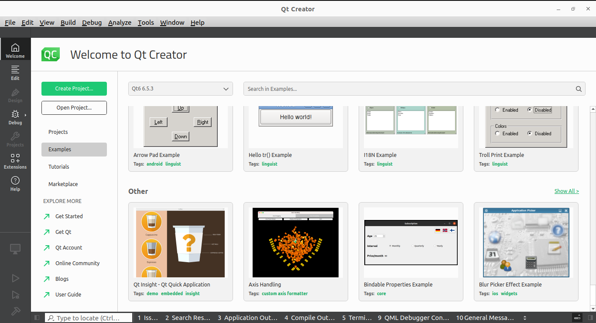
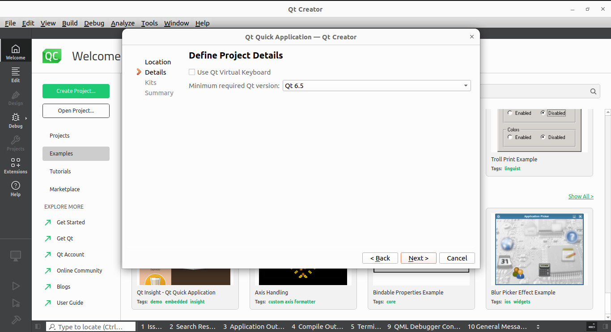
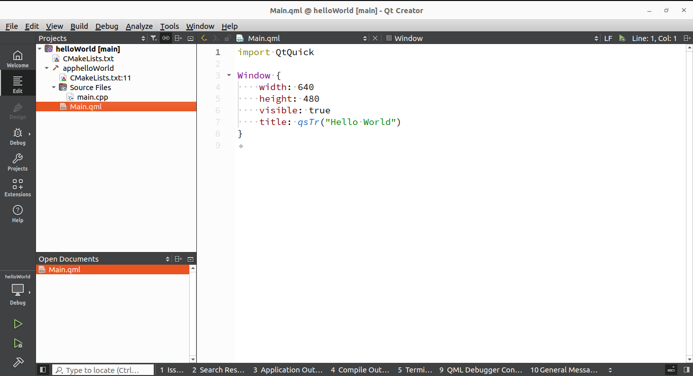
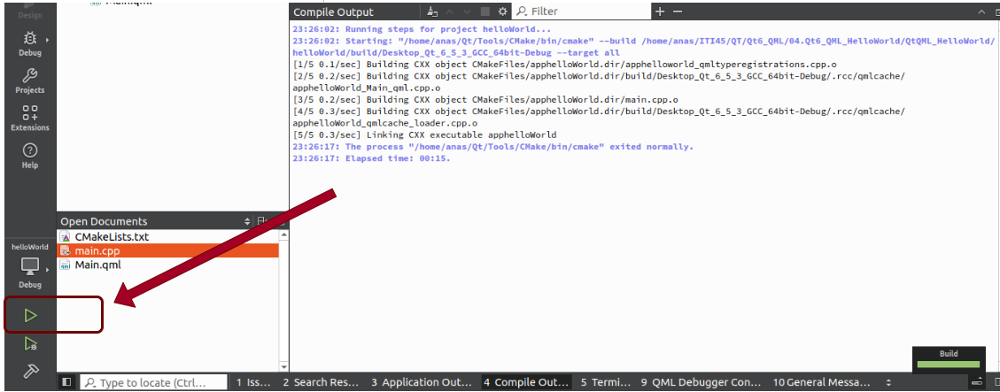

# Qt6_QML HelloWorld
After Install Qt Creator (Qt IDE) successfully, it will appear like that :



### 1. Create new Project 

- Select Qt Quick Application because, we will use Qt QML **NOT** Widgets or Qt Core

  >**Note That : **
  >
  >- Select **Qt Quick Application** : If you will use **Cmake** for Qt build system.
  >- Select **Qt Quick Application (compat)**: If you will use **Qmake** for Qt build system.
  >
  >


- Select Project Location 

  

- Select your Min Version

  

- Select Your Kit and Toolchain

  


### 2. Project Files



- **Main.qml File**

  This is the entry point for the **QML-based UI** in your Qt Quick application. It defines the user interface and application behavior using declarative QML syntax.

- **main.cpp**

  This is the entry point for the **C++ code** in your application. It initializes the Qt application and sets up the QML engine to load the `main.qml` file.

  >**Its purpose** :
  >
  >1. **Initialize the Application**: Creates a `QGuiApplication` (or `QCoreApplication` for non-GUI apps).
  >2. **Create a QML Engine**: Instantiates `QQmlApplicationEngine`, which is responsible for loading and running QML files.
  >3. **Load QML Files**: Loads the `main.qml` file (or any other QML file) to display the UI.
  >4. **Integrate C++ with QML**: You can expose C++ classes, objects, and functions to the QML layer for advanced functionality.

  


>**Code Explaintion ** :
>
>```c++
>#include <QGuiApplication>
>#include <QQmlApplicationEngine>
>```
>
>- **`#include <QGuiApplication>`**:
>
>  - Imports the `QGuiApplication` class, which provides the foundation for a Qt GUI application.
>  - It manages the application's lifecycle, event loop, and basic application settings.
>
>  >The **event loop** is a core concept in GUI frameworks (like Qt) and asynchronous programming. It is a programming construct that waits for and dispatches events or messages in a program.
>  >
>  >In the context of Qt and GUI applications, the **event loop** is responsible for:
>  >
>  >1. **Handling Events**:
>  >   - User interactions like mouse clicks, key presses, or touch events.
>  >   - System events like window resizing, application start/exit, or timers.
>  >2. **Managing Application State**:
>  >   - Ensuring that the application remains responsive to user input and updates the user interface.
>  >
>  >------------
>  >
>  >**How Does the Event Loop Work?**
>  >
>  >1. Wait for an Event:
>  >   - The event loop constantly runs, waiting for events like mouse clicks or keyboard inputs.
>  >2. Process the Event:
>  >   - When an event occurs (e.g., a button is clicked), it is placed in a queue.
>  >   - The event loop retrieves the event and dispatches it to the appropriate handler (e.g., a callback function or signal-slot mechanism in Qt).
>  >3. Repeat:
>  >   - Once the event is handled, the loop goes back to waiting for the next event.
>
>- **`#include <QQmlApplicationEngine>`**:
>
>  - Imports the `QQmlApplicationEngine` class, which is responsible for loading and managing QML files.
>  - This class allows the QML file to define the application's user interface.
>
>------------------
>
>**Main Function**
>
>```c++
>int main(int argc, char *argv[]) {
>```
>
>- The `main` function is the entry point of the application.
>- `argc` and `argv` pass command-line arguments to the application.
>
>--------------------------
>
>**Step 1: Create the QGuiApplication** :
>
>```c++
>QGuiApplication app(argc, argv);
>```
>
>- Creates an application object (`app`):
>  - Manages the GUI application's lifecycle.
>  - Processes system events, such as user input and window events.
>- Parameters:
>  - `argc` and `argv`: Command-line arguments, passed to configure the application.
>
>--------------------
>
>**Step 2: Instantiate the QML Engine**
>
>```c++
>QQmlApplicationEngine engine;
>```
>
>- Creates a QML engine (`engine`):
>  - This engine loads and executes QML files that define the UI.
>  - It manages QML objects, JavaScript context, and object lifetimes.
>
>-------------------------
>
>**Step 3: Handle Object Creation Failure**
>
>```c++
>QObject::connect(
>        &engine,
>        &QQmlApplicationEngine::objectCreationFailed,
>        &app,
>        []() { QCoreApplication::exit(-1); },
>        Qt::QueuedConnection);
>```
>
>- **What does this code do?**
>  - Connects the `objectCreationFailed` signal of the `engine` to a lambda function.
>  - If the QML engine fails to create the root object (e.g., due to missing or broken QML files), the application exits with a return code `-1`.
>- **How does it work?**
>  - **`QObject::connect`**: Links a signal to a slot (a callback function).
>  - **`engine.objectCreationFailed`**: Signal emitted when the QML engine fails to create objects.
>  - **`&app`**: The receiver of the signal is the `app` object.
>  - Lambda function:
>    - A short, anonymous function (`[]() { ... }`).
>    - In this case, it calls `QCoreApplication::exit(-1)` to terminate the application with an error code.
>- **`Qt::QueuedConnection`**:
>  - Specifies the type of signal-slot connection.
>  - `QueuedConnection` ensures the slot is executed asynchronously in the application's event loop.
>
>----------------------------------
>
>**Step 4: Load the QML File**
>
>```c++
>engine.loadFromModule("helloWorld", "Main");
>```
>
>- **Loads the QML code**:
>  - The `engine.loadFromModule()` method loads the root QML file using its **module name** and **file identifier**.
>- **Parameters**:
>  - `"helloWorld"`: Refers to the QML module name, defined in the `CMakeLists.txt` file using `qt_add_qml_module`.
>  - `"Main"`: Refers to the specific QML file within the module (in this case, `Main.qml`).
>- **How this works**:
>  - During compilation, `CMakeLists.txt` bundles QML files into the application resources, making them accessible by their module and identifier.
>  - This method avoids hardcoding file paths like `qrc:/main.qml` and promotes modularity.
>
>---------------------------
>
>**Step 5: Execute the Application**
>
>```c++
>return app.exec();
>```
>
>- Starts the event loop:
>
>  - This function enters the application's **main event loop**, which listens for user input, processes system events, and updates the UI.
>
>  - The **event loop** becomes the heart of the application once it is started.
>
>  - The event loop continuously:
>
>    - Waits for events (e.g., button clicks, key presses, timers, network events).
>
>    - Processes and dispatches those events to the appropriate handlers (e.g., signals/slots, QML bindings).
>
>    - Keeps the application responsive.
>
>  - The application will continue running until it is explicitly exited (e.g., when the main window is closed).
>
>  In this sense, while the `main()` function is the **starting point**, the **event loop** becomes the long-running process that powers the application's interactivity.


- **CMakeLists.txt File** :

  This is the **build configuration file** for the CMake build system. Qt 6 uses CMake as its official build system (replacing qmake). The file contains instructions for building your project, linking libraries, and managing resources.

  


### 3. Build and Run the helloWorld App

- **Build The App**


- **You Can Build + Run **

  


- Ensure That every thing is **OK** , and the compilation and linking **DONE** Successfully


---------

### Every Thing is OK , Let's Develop Valuable Apps  

--------------------

