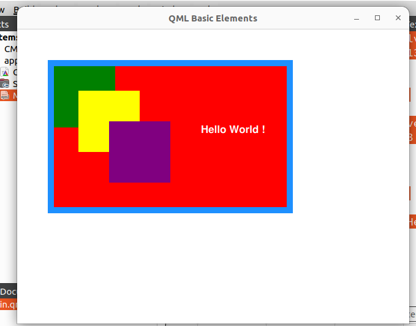
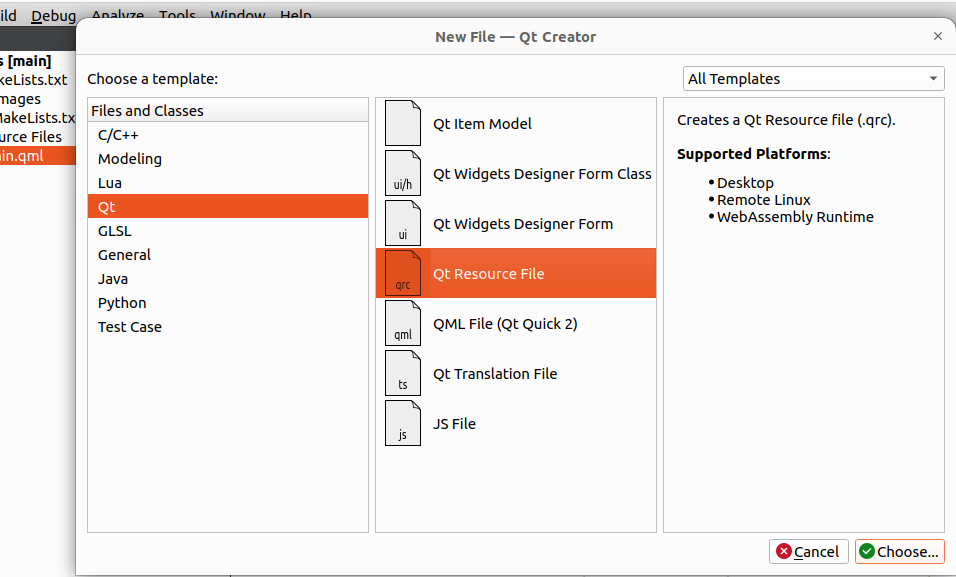
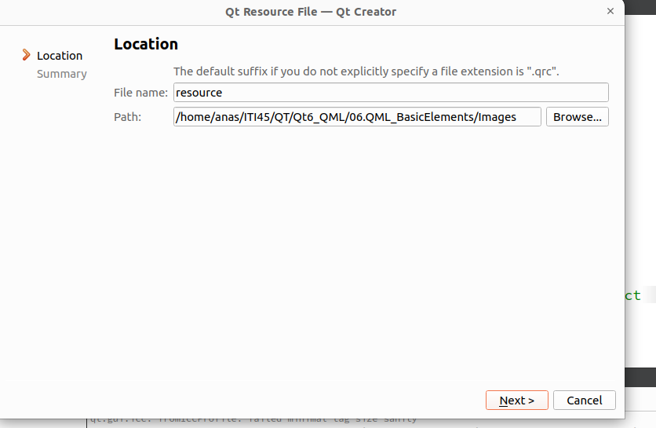
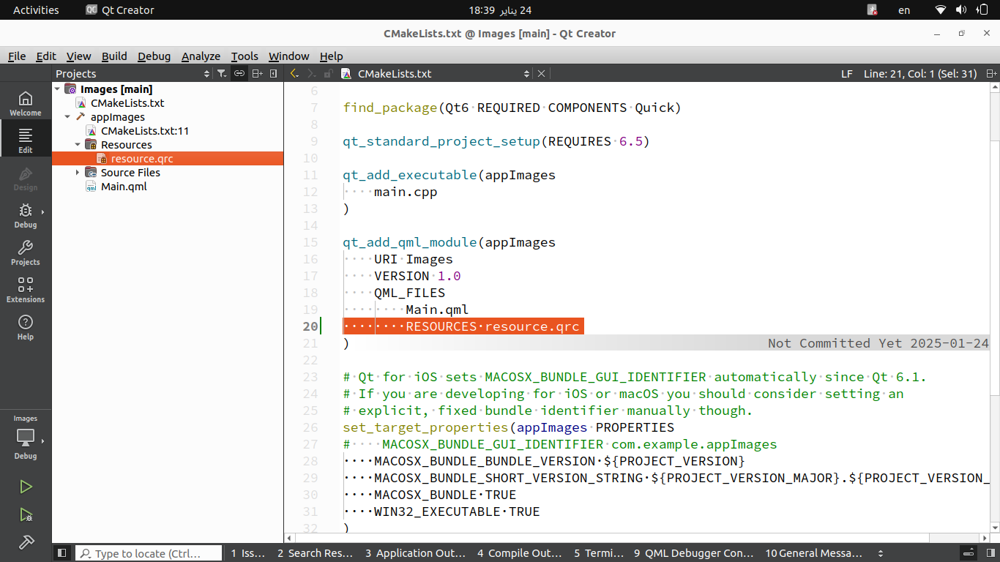
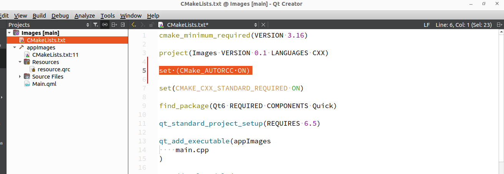
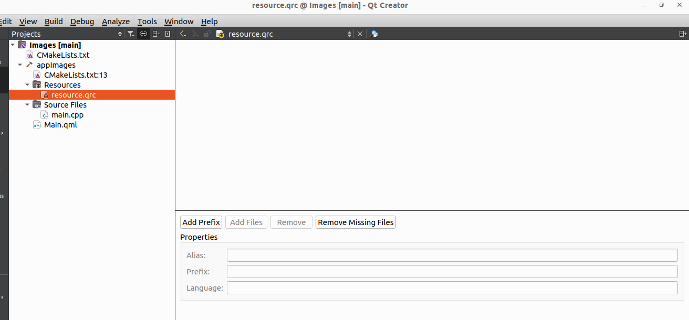
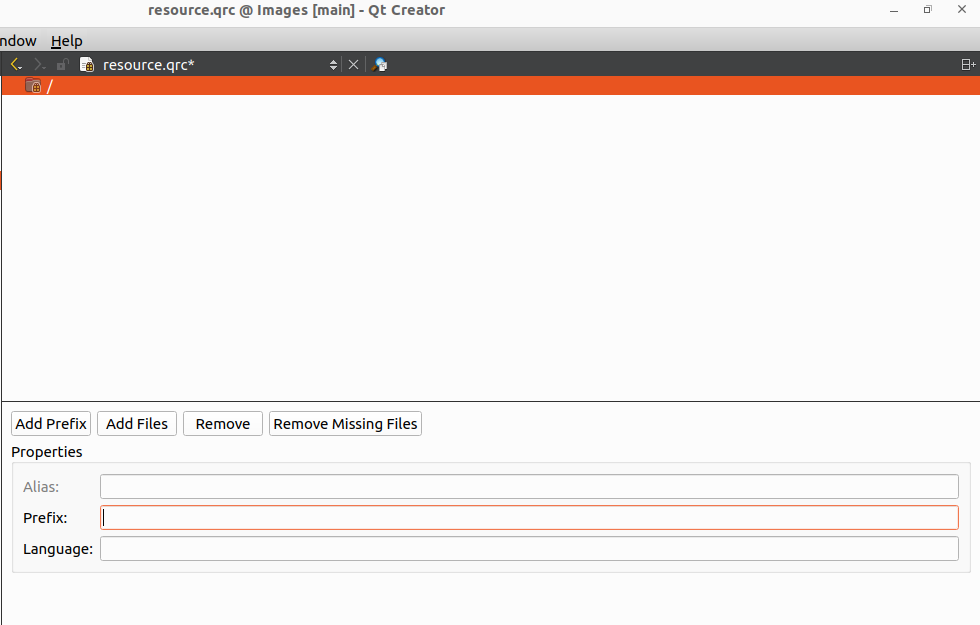
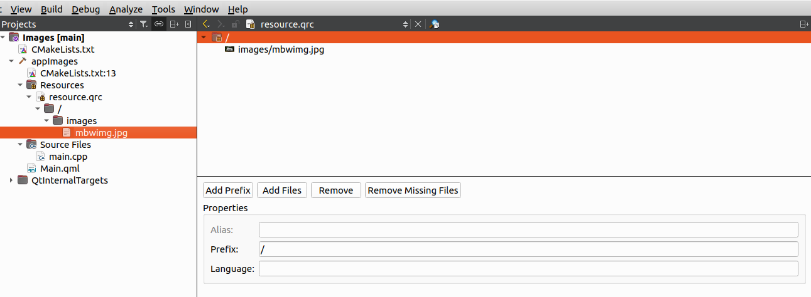

# Qt6 QML 
### QML Basic Elements

------------

### Contents

-  Rectangles
- Items (As Container)
- Text
- Element Hierarchy
- Grouped Properties
- Images

-------------------

### 1. **Item (as a container)**

#### What is `Item`?

- `Item` is the **base visual type** in Qt Quick for building UIs.
- It serves as a **container** for other visual elements like `Rectangle`, `Text`, and more.
- `Item` itself has no visual representation (no color, border, etc.), but it provides **positioning** and **sizing** capabilities.

#### Common Use Cases:

- **Parenting other elements:** Acts as a container or group for child items.
- **Positioning and alignment:** Provides layout-like behavior by anchoring or manually positioning elements.
- **Interaction area:** Can define an area for input events, even though it’s not visible.

#### Example in Your Code:

```c++
Item {
    id: containerItemId
    x: 50
    y: 50
    width: 400
    height: 250
}
```

- This `Item` serves as a container for all the `Rectangle` and `Text` elements defined within it.
- Its position (`x: 50, y: 50`) and size (`width: 400, height: 250`) dictate the bounds for the contained elements.

------

### 2. **Text**

#### What is `Text`?

- `Text` is a visual element used to display strings.
- It supports styling, positioning, and alignment features, making it highly flexible for UI design.

#### Key Properties:

- **`text`**: The string displayed.
- **`color`**: The text color.
- **`font`**: A grouped property to define the font style.
- **`horizontalAlignment` / `verticalAlignment`**: For aligning text within a bounding area.
- **`wrapMode`**: Determines how text behaves when it overflows its container.

#### Font Grouped Property:

- The `font` property allows you to define:
  - `family`: The font family (e.g., Helvetica, Arial).
  - `pointSize`: The size of the text.
  - `bold`: Whether the text is bold.
  - `italic`: Whether the text is italicized.

#### Syntax Variants in  Code:

1. **Syntax #1 (Individual Properties):**

   ```c++
   font.family: "Helvetica"
   font.pointSize: 13
   font.bold: true
   ```

2. **Syntax #2 (Grouped Property Block):**

   ```c++
   font {
       family: "Helvetica"
       pointSize: 13
       bold: true
   }
   ```

3. **Syntax #3 (Inline Syntax):**

   ```c++
   font.family: "Helvetica"; font.pointSize: 13; font.bold: true
   ```

These variations achieve the same result but cater to different coding styles or preferences.

------

### 3. **Grouped Properties**

#### What are Grouped Properties?

- Grouped properties are logical groupings of related properties under a single name.
- They simplify code and make it easier to organize and manage related properties.

#### Common Examples:

1. **`border`**: For controlling the appearance of borders in a `Rectangle`.
   - Properties: `color` (border color) and `width` (border thickness).
2. **`font`**: For styling text in a `Text` item.
   - Properties: `family`, `pointSize`, `bold`, etc.

#### Syntax Variants in  Code:

1. **Syntax #1 (Explicit Dot Notation):**

   ```c++
   border.color: "black"
   border.width: 10
   ```

2. **Syntax #2 (Block Grouped Syntax):**

   ```c++
   border {
       color: "blue"
       width: 15
   }
   ```

3. **Syntax #3 (Inline Syntax):**

   ```c++
   border.color: "dodgerblue"; border.width: 10
   ```

These variants are equivalent but cater to different readability and styling preferences.

------

### 4. Example Code Explanation

```c++
import QtQuick

Window {
    width: 640
    height: 480
    visible: true
    title: qsTr("QML Basic Elements")

    Item {
        id: containerItemId
         x:50
         y:50
         width: 400
         height: 250

         Rectangle{
             anchors.fill: parent // the Rectangle will fill its parent (Item)
             color: "red"

             //add border to rectangle [Grouped Property Syntax#1]

             /* border.color: "black"
             border.width: 10*/

             //Grouped Property [Syntax #2]

             /*border{
                 color: "blue"
                 width: 15
             }*/

             //Grouped Property [Syntax #3]

             border.color: "dodgerblue";border.width:10
         }

         Rectangle{
             x:10
             y:10
             width: 100
             height: 100
             color: "green"
         }

         Rectangle{
             x:50;y:50
             width: 100;height: 100;color: "yellow"
         }

         Rectangle{
             x:100;y:100
             width: 100;height: 100;color: "purple"
         }

         Text {
             id: txtId
             x:250
             y:100
             text: qsTr("Hello World !")
             color: "white"

             //Text Syntax #1
             font.family: "Helvetica"
             font.pointSize: 13
             font.bold: true

             //Text Syntax #2
             font{
                 family: "Helvetica"
                 pointSize: 13
                 bold: true
             }

             //Text Syntax #3

         //    font.family: "Helvetica";font.pointSize: 13;font.bold: true


         }
    }
}

```


#### Container Item:

- The `Item` provides a container for the child `Rectangle` and `Text` items.
- Positioned at `(50, 50)` with dimensions `400x250`.

#### Red Rectangle:

- Anchored to fill the entire `Item`.
- The grouped `border` property is used to style the rectangle’s border.

#### Other Rectangles:

- Green, Yellow, and Purple rectangles are positioned explicitly using `x` and `y` properties.
- Each has a unique size and color.

#### Text:

- The `Text` element displays "Hello World!" in white color.
- The font is styled using different grouped property syntax variants to demonstrate flexibility.

------

### 5. **Why Use Grouped Properties?**

- **Organized and Clear:** Easier to manage properties related to a single concept (e.g., `font` or `border`).
- **Flexible Syntax:** Choose between explicit, block, or inline syntax based on coding style or context.
- **Consistency:** Improves maintainability, especially in larger UIs.



---------------------

-------------------

### 6. Images in QML

In Qt QML, the `Image` element is used to display images in a user interface. Let's discuss the various ways to load images in detail.

**6.1. Loading an Image from the Working Directory**

The working directory is typically the directory from which the application is executed.

**Syntax:**

```c++
Image {
    source: "file:image.png"  // Relative path to the image in project working directory
}
```

**Example:**

If your application is executed in a directory containing an image file named `image.png`, this image will be loaded.

**Key Points:**

- The `source` property uses a **relative path** based on the working directory.
- If the image is not found in the working directory, the `Image` element will remain empty, and a warning will appear in the console.

-----------------

**6.2. Loading an Image from the Resource File**

In Qt, you can bundle images into a **Qt Resource System (`.qrc`)** file, which embeds them into the application's binary.

- **Create resource file** 

  - Right Click here then select **Qt resource File **

   






- Note that the **`resource.qrc`** File be added in CMake File 



- Then we should Instruct **Qt system** to use **Qt resource system** by Add this line in the CMake file 

  ```cmake
  set (CMake_AUTORCC ON)
  ```

  

- Right Click on the **`resource.qrc`** and open in editor

  

- **Add Prefix then Add Files**

  

- The image added 

  


**Steps:**

1. Add the image to your Qt Resource System (`.qrc`) file:

   - In `resources.qrc`:

     ```xml
     <RCC>
         <qresource prefix="/">
             <file>images/logo.png</file>
         </qresource>
     </RCC>
     ```

2. Reference the image using a `qrc:` URL or a relative resource path starting with `:/`:

   ```c++
   Image {
       source: "qrc:/images/logo.png" // OR
       source: ":/images/logo.png"
   }
   ```

**Example:**

```c++
Image {
    source: ":/images/logo.png"
}
```

- Using resources ensures images are always available to your application, even after deployment.
- Resource files are embedded in the application binary, making them platform-independent.

----------------------------------------------------------

**6.3. Loading an Image by Full Path**

You can use an absolute file path to load an image from anywhere on the filesystem.

**Syntax:**

```c++
Image {
    source: "file:///absolute/path/to/image.png"
}
```

**Example:**

```c++
Image {
    source: "file:///C:/Users/Username/Pictures/image.png" // Windows
    // OR
    source: "file:///home/username/Pictures/image.png" // Linux/macOS
}
```

- The `file://` prefix is mandatory for absolute paths.
- Ensure that the application has permission to access the specified path.
- This method is less portable because it relies on the specific file system structure.

---------------------

**6.4. Loading an Image from the Internet**

To load an image from a URL, simply set the `source` property to the image's URL.

#### Syntax:

```c++
Image {
    source: "https://example.com/image.png"
}
```

#### Example:

```c++
Image {
    source: "https://upload.wikimedia.org/wikipedia/commons/a/a7/Qt_logo_2016.svg"
    asynchronous: true // Optional: Enables non-blocking loading
}
```

- The `asynchronous` property (default: `true`) allows the image to load without blocking the main thread.
- Make sure the device running the application has internet access.
- If the image fails to load, an error message appears in the console.

------

### Best Practices for Image Loading:

1. **Prefer Resources for Static Assets:**

   - Use `.qrc` files for images that ship with the application.
   - They provide better portability and reliability.

2. **Handle Missing Images Gracefully:**

   - Use the `onStatusChanged` signal to handle loading failures:

     ```c++
     Image {
         source: "https://example.com/image.png"
         onStatusChanged: if (status === Image.Error) console.error("Failed to load image")
     }
     ```

3. **Optimize Network Usage:**

   - Use caching mechanisms or `QtNetworkAccessManager` to download and store images locally when loading from the internet.

4. **Use Full Paths Sparingly:**

   - Full paths are brittle and platform-dependent. Avoid them in production code.

-------------------------------------------

**Summary Table:**

| **Source Type**            | **Syntax**                             | **Notes**                                                |
| -------------------------- | -------------------------------------- | -------------------------------------------------------- |
| **Working Directory**      | `"image.png"`                          | Relative path to the current working directory.          |
| **Resource File (`.qrc`)** | `"qrc:/images/logo.png"`               | Portable and embedded in the application binary.         |
| **Full Path**              | `"file:///absolute/path/to/image.png"` | Absolute file path; less portable.                       |
| **Internet URL**           | `"https://example.com/image.png"`      | Requires internet access; supports asynchronous loading. |

---------------------------------
