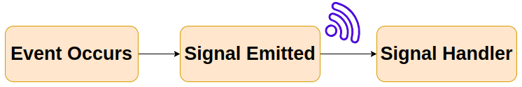

# Qt6 QML
### Signals and Slots

---------------------------

Signals and slots are a core feature of Qt, enabling seamless communication between objects in a flexible, event-driven programming model. They are especially powerful in designing GUI applications. Below is an overview of signals and slots in **Qt 6**:

- **Signals**: A signal is emitted when an event occurs. For example, a button emits the `clicked` signal when it is clicked.
- **Slots**: A slot is a function that can be connected to a signal to execute code when the signal is emitted.

The signals and slots mechanism replaces traditional callback functions, offering a more robust and type-safe approach.




------

### **Key Features in Qt 6**

1. **Modern C++ Integration**: Qt 6 signals and slots are tightly integrated with modern C++ features such as lambda expressions, function pointers, and type inference.
2. **Strong Typing**: Signals and slots are strongly typed, ensuring type safety at compile time.
3. **Automatic Connections**: Using `QObject::connect`, connections between signals and slots can be made automatically if their names follow specific conventions.

------

### **Defining Signals and Slots**

1. **Signals**:

   - Declared in a `QObject`-derived class using the `signals` keyword.
   - Do not have a return type (not even `void`).

   Example:

   ```
   cppCopyEditclass MyClass : public QObject {
       Q_OBJECT
   
   signals:
       void mySignal();
       void valueChanged(int newValue);
   };
   ```

2. **Slots**:

   - Declared using the `slots` keyword (optional, as any callable function can act as a slot in Qt 6).
   - Can have any access modifier (`public`, `protected`, or `private`).

   Example:

   ```
   cppCopyEditclass MyClass : public QObject {
       Q_OBJECT
   
   public slots:
       void mySlot();
       void updateValue(int value);
   };
   ```

------

### **Connecting Signals and Slots**

Signals and slots are connected using the `QObject::connect` function.

#### 1. **With Member Functions**:

```
cpp


CopyEdit
connect(sender, &SenderClass::signal, receiver, &ReceiverClass::slot);
```

Example:

```
cpp


CopyEdit
connect(button, &QPushButton::clicked, this, &MyClass::onButtonClicked);
```

#### 2. **With Lambda Functions**:

You can connect a signal to a lambda for inline handling:

```
cppCopyEditconnect(button, &QPushButton::clicked, this, []() {
    qDebug() << "Button clicked!";
});
```

#### 3. **With QML Signals**:

In Qt Quick (QML), you can connect QML signals to C++ slots and vice versa using `connect`.

Example in QML:

```
qmlCopyEditButton {
    text: "Click Me"
    onClicked: cppObject.doSomething()
}
```

------

### **Signal and Slot Features in Qt 6**

1. **Connection Types**:

   - **Direct Connection**: The slot is invoked immediately in the emitter's thread.
   - **Queued Connection**: The slot is invoked in the receiver's thread through the event loop.
   - **UniqueConnection**: Ensures that the connection is established only once.

   Example:

   ```
   cpp
   
   
   CopyEdit
   connect(sender, &SenderClass::signal, receiver, &ReceiverClass::slot, Qt::UniqueConnection);
   ```

2. **Disconnecting**: You can disconnect signals and slots explicitly:

   ```
   cpp
   
   
   CopyEdit
   disconnect(sender, &SenderClass::signal, receiver, &ReceiverClass::slot);
   ```

3. **Default Parameters**: Slots can have default parameters, and they are used when the signal is emitted.

   Example:

   ```
   cpp
   
   
   CopyEdit
   void someSlot(int value = 0);
   ```

------

### **New Features in Qt 6**

- **Enhanced Performance**: Qt 6 has improved the internal implementation of signals and slots, making them faster and more efficient.
- **Improved Type System**: Allows better type checking and support for custom types through `QMetaType`.

------

### **Best Practices**

1. Always prefer `Qt::UniqueConnection` to avoid multiple connections.
2. Use lambda functions for concise, inline signal handling.
3. Avoid overloading signals with the same name and different parameters to reduce ambiguity.
4. Disconnect signals explicitly to avoid dangling connections, especially in dynamic or multi-threaded applications.

------

Signals and slots are a foundational feature of Qt, and Qt 6 enhances their usability and performance, making them even more powerful for modern applications.


